# Welcome

This guide walks you through your first month of bookkeeping in LineLedger, from a brand-new account to a reconciled bank statement and a clean set of month-end reports.

*Written for LineLedger 1.1.0 (September 2026).*

We follow a small, real-world story: the **Edgemont Photo Club**, an unincorporated association in North Vancouver, British Columbia. Riley Park, the club's volunteer treasurer, sets the club up in LineLedger on January 1, 2026. During January the club:

1. Creates its organization with a standard non-profit chart of accounts
2. Sets up a **Founding Member** membership level at **$10 per year**
3. Welcomes its first member, **Alex Tremblay**, and invoices their dues
4. Collects the $10 in cash and deposits it at the bank
5. Reconciles the January bank statement, which includes a **$2 bank service charge**
6. Reads the month-end reports: balance sheet, income statement, cash flow, and the membership roster

By January 31 the club's books show exactly what happened: **$10 of membership revenue, $2 of bank charges, and $8 in the bank** — proven against the bank statement to the penny.

Nothing in this guide requires an accounting background. Where a bookkeeping idea matters (and only where it matters), a short *Why this matters* note explains it in plain language.

> **Note.** LineLedger's interface says **organization** for what accountants might call the company, entity, or society — though a few screens, such as the last step of the setup wizard, still say *company*. They are the same thing. This guide says organization throughout.

> **Tip.** Every number, name, and date in this guide comes from a real LineLedger session — the screenshots are unretouched. Follow along with your own club's details and your screens will match. The only dates that won't are the ones LineLedger takes from the real calendar: the months on the dashboard's cash-flow chart and the moment a reconciliation is completed follow the day you do the work — September 2026, for these screenshots.

# Create Your Account and Organization

Everything starts at the registration page. If your club is self-hosting LineLedger, browse to your server's address; otherwise use your LineLedger provider's sign-in page.

## Register

On the login page, click **Sign up** next to *Don't have an account?* (or browse to `/register`). On *Create an account*, fill in your name, email address, and a password (twice, to confirm it). Tick the box agreeing to the Terms of Service and Privacy Policy and click **Create account**.

A banner along the bottom of the page may offer to take you to the other country's LineLedger site (*Go to Canada* / *Stay here*, or the reverse). The hosted service runs one site for Canada and one for the United States, and a Canadian club belongs on the Canada site — so accept the offer only if it's pointing you there. On your club's own server, simply click **Stay here**, as we did before taking the screenshot below. The small print at the foot of the page — *© 2026 Local Foundry Inc. · v1.1.0 · AGPL-3.0 · Source · Legal* — tells you which LineLedger version you're running.

*Figure 1 — Registering the treasurer's account.*

> **Note.** You may be asked to accept the Terms of Service and Privacy Policy again
> later, if they've been updated since you signed up. It's a one-click prompt and it
> won't cost you any work in progress.

## Verify your email address

Before you can set up an organization, LineLedger checks that the email address is really yours. After **Create account** the page reads *Please verify your email address by clicking on the link we just emailed to you.* Open that email and click the link, and LineLedger takes you on to the setup wizard. Nothing arrived? Check your spam folder, then click **Resend verification email**. (On a self-hosted server the email only goes out once whoever runs the server has set up outgoing mail.)

## The setup wizard

Once your email is verified, a new account with no organizations lands directly in the eight-step setup wizard, *Setup your organization*. The steps are listed down the left side — Organization info, Organization, Industry & accounts, Features, Sales tax, How to start, Review accounts, and Confirm — and the headings below use the same names. Each one is a quick decision, and the wizard tells you when something can be changed later.

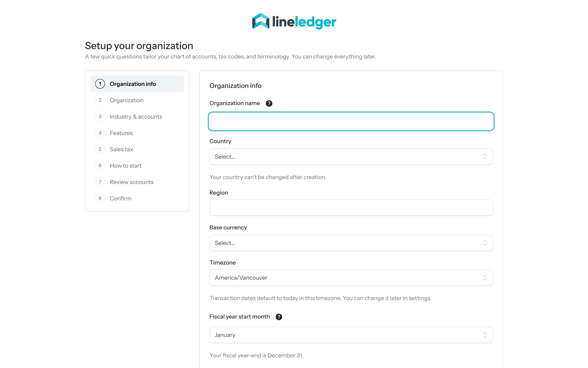
*Figure 2 — The setup wizard. Eight small steps, most with sensible defaults.*

## Step 1 — Organization info

Enter the organization name and where it operates. Choose the country with care: as the line under it says, *Your country can't be changed after creation*. For the Edgemont Photo Club:

| Field | Value |
|---|---|
| Organization name | Edgemont Photo Club |
| Country | Canada |
| Province | British Columbia *(the field is labelled Region until you pick Canada)* |
| Base currency | CAD — Canadian Dollar |
| Timezone | America/Vancouver *(detected from your browser)* |
| Fiscal year start month | January |

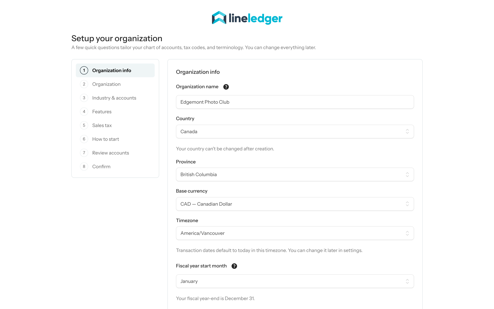
*Figure 3 — Organization info. Note the confirmation under the last field: "Your fiscal year-end is December 31."*

> **Tip.** The **fiscal year start month** controls how reports group your years. Most clubs run on the calendar year — start month January, year-end December 31 — which is what we chose. If your association's bylaws set a different year-end, pick the month your fiscal year *begins*.

## Step 2 — Organization

The panel asks *How is your organization organized?* Choose **Non-profit or charity**. A second question appears, *What is your legal structure?*, with **Non-profit corporation** picked for you and a third question beneath it: *How do you account for restricted contributions?* Choose **Unincorporated association** instead — what most small clubs are: a group of people with a constitution and an executive, but no incorporation papers. The contribution question disappears, and a note confirms the books will be set up as an unincorporated association — membership-dues income, expenses, and net assets — using the deferral method for dues paid in advance.

*Figure 4 — Non-profit or charity, then Unincorporated association in place of the default, Non-profit corporation.*

> **Why this matters.** This single choice tunes the vocabulary of your books. Equity becomes **Net Assets** on your statements and in your account names, the bottom line of your income statement becomes **Excess (deficiency) of revenue over expenses**, and there are no owner draws or share capital anywhere — because a club has none. Incorporated non-profits and registered charities are also asked how they account for restricted contributions, and a registered charity gives its CRA registration number too; an unincorporated association keeps it simple, with the deferral method chosen for it.

## Step 3 — Industry & accounts

Under *Select your industry*, keep the **Standardized accounts** tab selected and choose **Non-profit**. This is what builds your standard chart of accounts in the next steps — including accounts like *Membership Dues* and *Donations & Contributions* that a generic business chart wouldn't have.

*Figure 5 — Standardized accounts with the Non-profit industry template.*

## Step 4 — Features

Under *What do you want to track?*, LineLedger pre-selects four features for a non-profit: **Employees**, **Fixed assets**, **Membership**, and **Donations & grants**. Keep **Membership** switched on — it adds Members, membership levels, dues billing, and the membership roster report — and switch the other three off: the photo club has no employees or fixed assets and isn't fundraising yet. Any feature can be turned on later in settings.

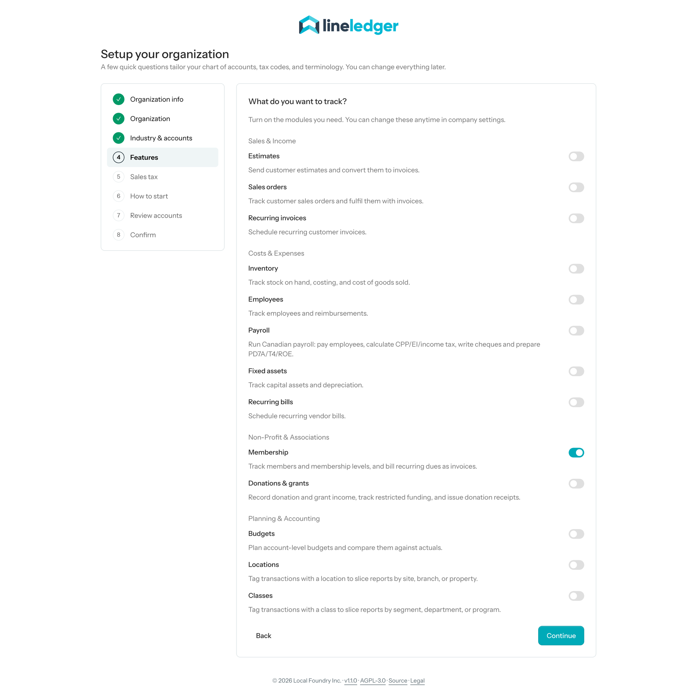
*Figure 6 — Membership is the one feature this club needs from day one; the other three suggestions are switched off.*

## Step 5 — Sales tax

The panel asks *Do you charge sales tax?* For a British Columbia organization it shows two switches, both on to start: **I charge GST/HST** and **I charge PST** (*We will add a PST payable account and tax code for British Columbia*). The Edgemont Photo Club is **not registered for GST/HST** — like most small associations under the $50,000 small-supplier threshold — and doesn't collect BC's PST either, so switch **both** off.

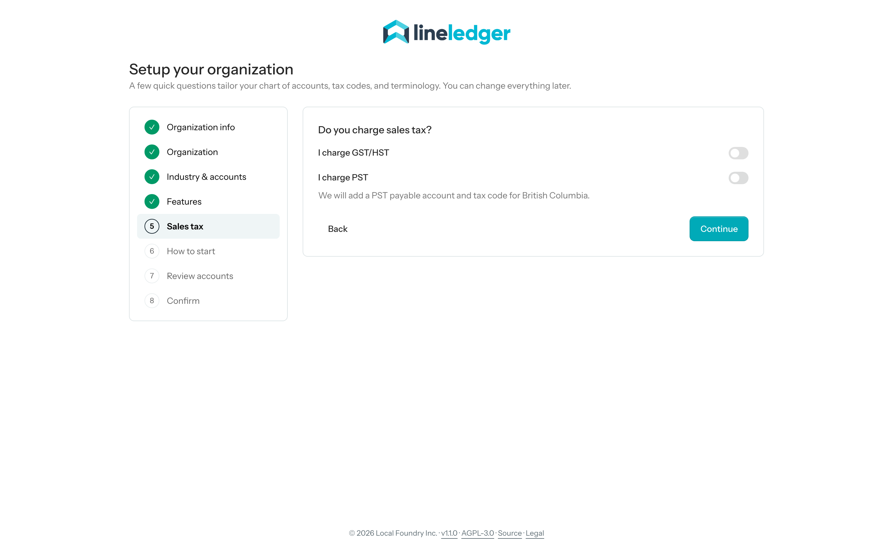
*Figure 7 — Not registered for GST/HST or PST: both switches off.*

> **Tip.** If your association registers for GST later, you can turn tax collection on in settings at any time. With both switches off, no sales-tax accounts are created and every invoice's *Tax* total simply reads 0.00. (The per-line *Tax* column is hidden on the invoice form by default; the form's **Fields** menu shows it when you need it.)

## Step 6 — How to start

Choose **Start fresh** and set the start date — it opens at today's date — to the first day of your fiscal year: **January 1, 2026** for the club. Transactions you record will begin from this date.

*Figure 8 — Starting fresh as of January 1, 2026.*

> **Tip.** Set the start date even if you're doing your setup partway through the year. It marks where your LineLedger books begin.

## Step 7 — Review accounts

Under *Review your chart of accounts*, the wizard shows the chart it's about to create — 28 accounts tailored to a Canadian non-profit, grouped as Asset, Liability, Net Assets, Income, and Expense. Required and system accounts are locked on; optional ones can be unticked. The defaults are good: keep them all.

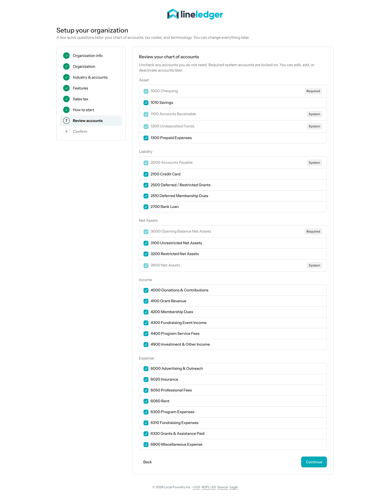

*Figure 9 — The standard non-profit chart, including 4200 Membership Dues.*

## Step 8 — Confirm

The last panel, *Ready to create your company*, sums up the choices that shape your books: **Company** Edgemont Photo Club, **Jurisdiction** Canada · CAD, **Organization** Club / Association, **Legal structure** Unincorporated association, **Contribution method** Deferral method, and **Chart of accounts** Non-profit · 28 accounts. Check it over and click **Create organization**.

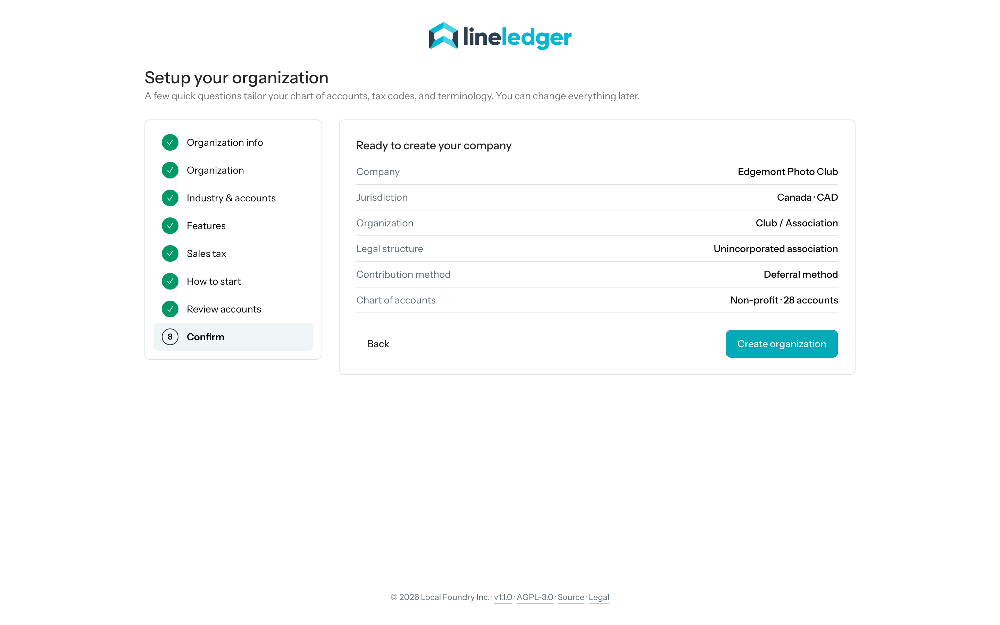
*Figure 10 — Ready to create: Canada · CAD, Club / Association, Unincorporated association, Deferral method, Non-profit · 28 accounts.*

## Your new dashboard

A few seconds later you land on the dashboard: cash on hand, accounts receivable, accounts payable, net income for the month, a cash-flow chart of the last six months, and a list of recent transactions — all zeros or empty, which is exactly right for a brand-new set of books. The blue card at the top is a short stack of getting-started tips; each one links to the page it describes and can be marked done as you go. Just below *Dashboard* in the sidebar, *Insights* keeps a short daily note about your books.

Because the club is a non-profit, LineLedger starts its sidebar with a few sales-minded pages hidden — Customers, Sales receipts, Credit memos, Purchase orders, and Vendor credits. That's why **Show all sections** sits at the bottom of the list: it brings them back for the moment, and *Show fewer* tucks them away again. The first tip, *Customize your sidebar*, opens *Settings → Sidebar* if you'd rather choose for good. *Inbox*, just above, collects receipts and bills you upload or email in; this guide doesn't need it.

*Figure 11 — A fresh organization. The sidebar already shows Members under Revenues because the Membership feature is on.*

## Getting around

Before the bookkeeping starts, four small conveniences that make the rest of this guide
quicker. None is required; all are on from the first day.

- **Escape goes back.** On any page, pressing Escape does what the browser's Back button
  does. If something is open on the page — a dialog, a dropdown menu — Escape closes that
  first and the page stays put; and if you've typed into a form and not saved it, LineLedger
  asks "Leave this page?" before moving. It's a per-user setting: switch it off under
  *Settings → Appearance* ("Escape goes back") if you'd rather keep the key for the browser.
- **Click anywhere in a date field** to open the calendar — not just the small icon at its
  edge. Tabbing into a date field doesn't open it, so typing a date stays the fast path.
  You'll backdate a lot of January dates in the chapters ahead.
- **Dollar fields do arithmetic.** Type `3*10` or `12.50+7.50` into an amount field and a
  small tape shows the working; press Enter (or leave the field) and the result is what's
  saved. Plus, minus, times (`*`, `x` or `×`) and divide (`/` or `÷`) all work, with the
  usual precedence.
- **The organization switcher opens a new tab.** The organization name at the top of the
  sidebar is a menu; picking another organization opens it in a new tab and leaves this one
  where it was — handy for a treasurer who keeps the books for two clubs.

# Meet Your Chart of Accounts

Open **Accounting → Chart of Accounts** (or browse to *Accounts*). Everything the wizard promised is here, organized the way accountants expect under the headings Asset, Liability, Equity, Income, and Expense. *Equity* is where a non-profit's net assets live — the wizard's preview called the same group *Net Assets*.

> **Why this matters.** Every dollar in LineLedger lives in exactly one account, and every transaction moves dollars between two or more of them — that's all double-entry bookkeeping is. You'll see it in action in the chapters ahead; the chart is simply the list of places money can be.

The accounts this guide touches:

| Code | Account | What it holds |
|---|---|---|
| 1000 | Chequing | The club's bank account |
| 1100 | Accounts Receivable | Dues invoiced but not yet collected |
| 1200 | Undeposited Funds | Cash collected but not yet taken to the bank |
| 4200 | Membership Dues | Dues revenue |
| 2510 | Deferred Membership Dues | Dues collected for future periods (not needed this month) |
| 3xxx | Net assets (under *Equity*) | The non-profit equivalent of equity |

Every code and name in the list is a link: click either to open that account's **General
Ledger** — each entry posted to it, from the start of the fiscal year to today (the row's
action menu offers the same *View ledger*). Come back after the reconciliation chapter and
1000 Chequing will show the deposit and the service charge exactly as Appendix B lists them.

*Figure 12 — The full chart: 28 accounts, all at 0.00. The Equity section holds the net-asset accounts: Opening Balance Net Assets, Unrestricted Net Assets, Restricted Net Assets, and the system Net Assets account.*

> **Note.** The club's chequing account starts at **$0.00** because the club is starting fresh. If your club already has money in the bank, the organization's owner can open **Accounting → Opening balances**, set the as-of date to the day before your LineLedger start date (December 31, 2025, for a club starting on January 1, 2026), and enter the bank balance against 1000 Chequing on the *Trial balance* tab; LineLedger posts the opening entry for you. The in-app *Opening balances* guide walks through it.

## Adding an account you need

The standard chart covers most of a club's life, but sooner or later you'll want an account it doesn't have. The club's credit union charges a monthly service fee, and good bookkeeping gives bank fees their own expense account rather than burying them in *Miscellaneous Expense*.

Click **New account** and fill in:

| Field | Value |
|---|---|
| Code | 6010 |
| Name | Bank Charges |
| Type | Expense: Expense |

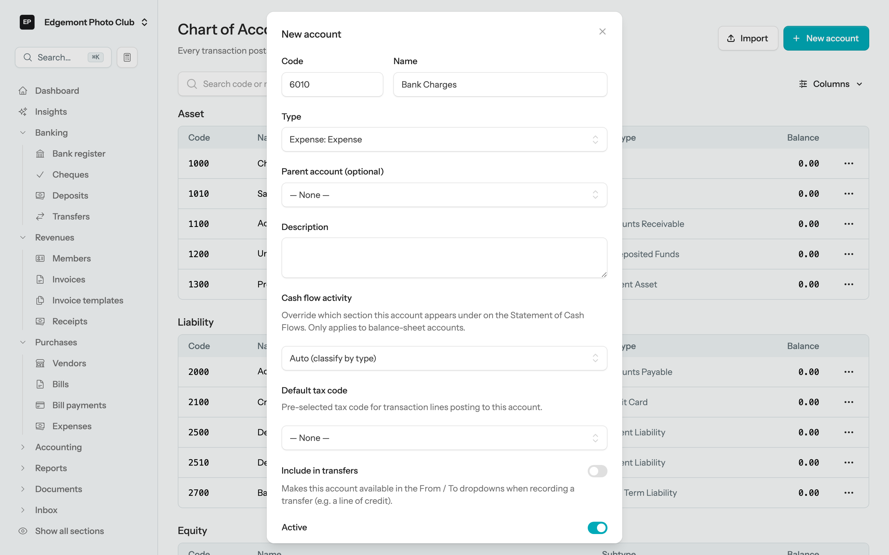
*Figure 13 — Adding 6010 Bank Charges. Codes in the 6000s keep it sorted with the other expenses.*

Click **Save**. The account appears in the expense section, ready for the bank reconciliation at month-end.

# Set Up a Membership Level

A membership level describes a kind of membership your club offers: what it's called, what it costs, how often it renews, and — importantly for the books — which revenue account its dues land in.

Open **Settings → Lists → Membership levels**.

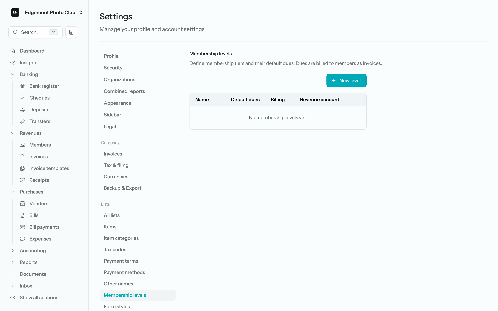
*Figure 14 — Membership levels live under Settings → Lists.*

Click **New level** and create the club's first membership type:

| Field | Value |
|---|---|
| Name | Founding Member |
| Default dues | 10.00 |
| Billing frequency | Annual |
| Revenue account | 4200 — Membership Dues |
| Default terms | Due on receipt |

*Figure 15 — Founding Member: $10 per year, posting to 4200 Membership Dues, due on receipt.*

> **Tip.** The **revenue account** on the level is the magic. Every dues invoice generated from this level posts its revenue there automatically — you'll never pick an account by hand when billing members.

Click **Save**. The level is ready to assign.

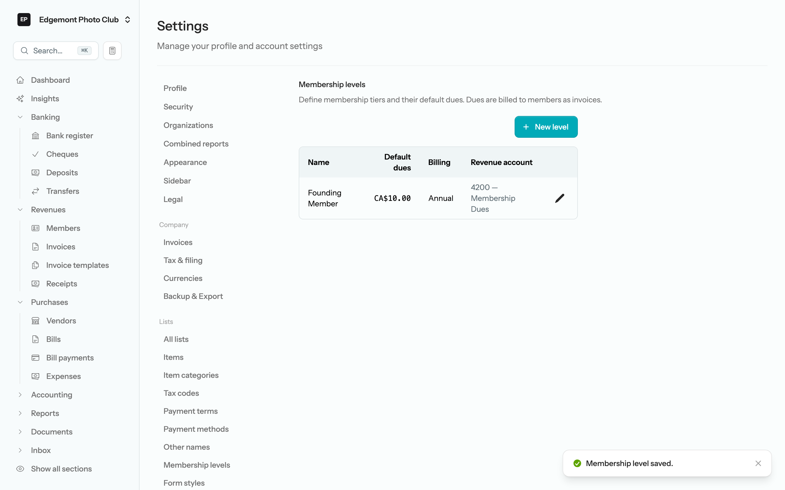
*Figure 16 — One level, CA$10.00, Annual. Add as many levels as your club has membership types.*

# Add Your First Member

On January 5, Alex Tremblay signs up as the club's first Founding Member.

Open **Revenues → Members** in the sidebar and click **New member**. A member in LineLedger is a contact (name, email, address) plus a membership (level, dates, dues), created together on one form. Keep **New contact** selected at the top and fill in:

| Field | Value |
|---|---|
| Name | Alex Tremblay |
| Email | alex.tremblay@example.com |
| Country *(under Address)* | CA *(a two-letter code)* |
| Membership level | Founding Member (CA$10.00) |
| Joined | 2026-01-05 |
| Term start | 2026-01-05 |
| Expires | 2027-01-04 *(type it in)* |

*Joined* and *Term start* open at today's date, and *Expires* starts empty — choosing an annual level doesn't fill it in, so type the last day of Alex's first year yourself.

*Figure 17 — One form, two halves: who the member is, and what membership they hold.*

> **Note.** Leave **Dues override** blank to use the level's default ($10), and leave **Auto-renew** off for now — chapter 11 covers letting LineLedger generate renewal invoices automatically.

Click **Save** and you land on Alex's member page: membership number **MEM-000001**, level, status, key dates — and a **Bill dues now** button, which is where the bookkeeping begins.

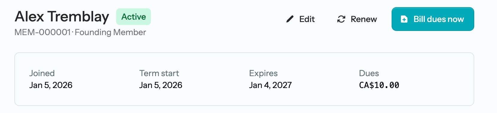
*Figure 18 — The member page header. Below it, the page keeps a running list of every dues invoice for Alex — empty for a few more minutes.*

# Bill the Dues

Click **Bill dues now** on Alex's member page. LineLedger drafts a dues invoice and opens it for review on the *Edit invoice* page — customer, invoice number, memo, and the $10 line item already filled in from the membership level.

Two things to set, because the club is backdating to the day Alex actually joined — both start at today's date:

1. **Date**: 2026-01-05
2. **Due date**: 2026-01-05 *(the level's terms are "due on receipt")*

*Figure 19 — The drafted invoice: one line, "Membership dues: Founding Member", $10.00 to account 4200. The totals read Tax 0.00 — the club charges no GST or PST.*

The invoice is still a **draft** — it hasn't touched the books. When it looks right, click **Post invoice**.

*Figure 20 — INV-000001, posted. Balance due $10.00. The "GL entry JE-000001" chip links to the exact ledger entry this invoice created.*

> **Why this matters.** Posting the invoice records revenue the club has *earned*, even though no cash has arrived yet — that's accrual accounting, and it's why your reports can distinguish "members owe us money" from "money in the bank." In ledger terms, posting INV-000001 moved $10 into Accounts Receivable and $10 into Membership Dues revenue:

| Account | Debit | Credit |
|---|---:|---:|
| 1100 — Accounts Receivable | $10.00 | |
| 4200 — Membership Dues | | $10.00 |

# Record the Payment

At the January 12 club meeting, Alex hands Riley a ten-dollar bill. Time to record it.

Open invoice INV-000001 and click **Receive payment**. The receipt form opens with the customer, amount, and invoice application already filled in. Set:

| Field | Value |
|---|---|
| Date | 2026-01-12 |
| Amount | 10.00 *(pre-filled)* |
| Deposit to | 1200 — Undeposited Funds *(the default)* |
| Payment method | Cash |

*Figure 21 — Receipt REC-000001: $10 cash, applied to INV-000001, held in Undeposited Funds.*

> **Why this matters.** **Undeposited Funds** is the envelope in the treasurer's desk drawer: money the club has received but hasn't taken to the bank yet. Recording cash there (instead of straight into Chequing) means your books can match the bank statement *exactly* — the bank sees one deposit on the day you visit the credit union, not a trickle of individual receipts.

Click **Save & post**. The invoice flips to **Paid**:

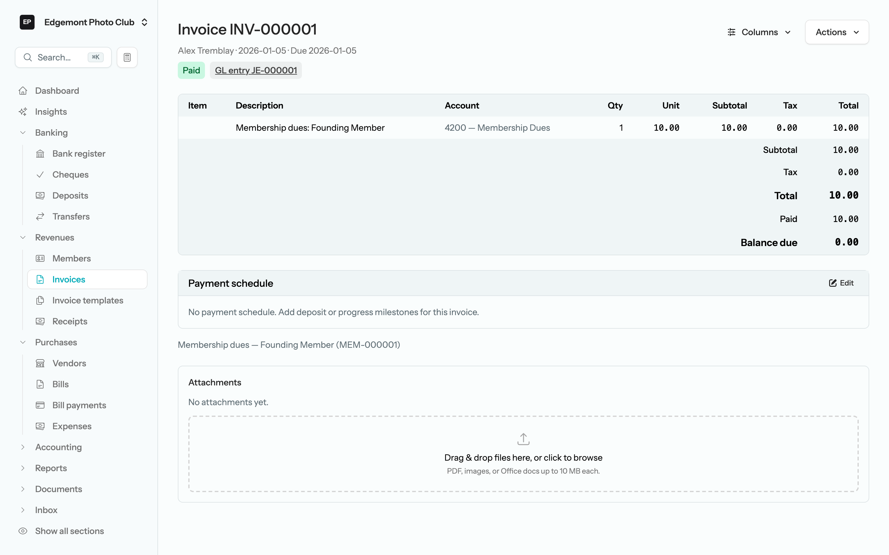
*Figure 22 — Paid in full. Balance due $0.00.*

The ledger entry behind REC-000001 — the $10 moves from "owed to us" to "in the drawer":

| Account | Debit | Credit |
|---|---:|---:|
| 1200 — Undeposited Funds | $10.00 | |
| 1100 — Accounts Receivable | | $10.00 |

# Make the Deposit

On January 15, Riley takes the cash to the credit union. Record it under **Banking → Deposits → Make deposit**:

| Field | Value |
|---|---|
| Deposit to | 1000 — Chequing |
| Date | 2026-01-15 |
| Undeposited receipts | tick REC-000001 — Alex Tremblay — Cash — $10.00 |

Every receipt sitting in Undeposited Funds is listed under *Undeposited receipts*: date,
receipt number, who paid, the payment type (the *Cash* you chose on the receipt), reference
and amount. A new deposit opens with nothing ticked — tick REC-000001 and the deposit total
becomes $10.00. With more members you'd tick several receipts into one deposit — one line on
the bank statement, one deposit in the books. The checkbox in the header row ticks them all
(and clears them all again), any column header sorts the list (click it again to flip the
direction), and the receipt number is a link that opens that receipt in a new tab, so the
half-built deposit survives the detour.

> **Tip.** The **Export** menu beside the *Undeposited receipts* heading downloads the list as
> PDF, CSV or Excel, in the order shown and with the ticks as they stand; the PDF and Excel
> copies also carry the deposit-to account and an "N of M selected" line. Print the PDF and
> it's the deposit slip for the trip to the credit union.

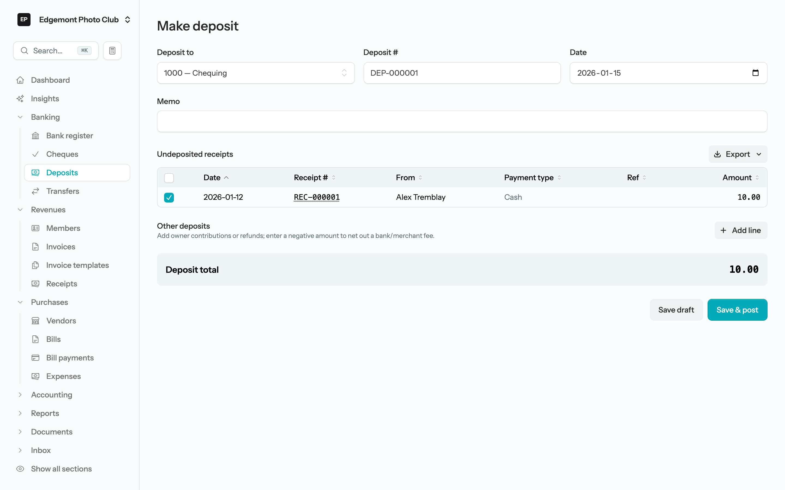
*Figure 23 — DEP-000001: REC-000001 ticked, one $10 receipt deposited to Chequing on January 15.*

Click **Save & post**, then have a look at **Banking → Bank register**. The register is a
read-only chequebook view of the account. The deposit is there — its Memo column reads
"Deposit:" followed by whatever memo you typed on the deposit, or just "Deposit" when, as
here, the Memo field was left blank — and the ledger balance reads **$10.00**, cleared
balance still $0.00, because nothing has been reconciled against a bank statement yet.
There's nothing to tick here: the empty box beside the deposit just means *not cleared
yet*, and it becomes a green tick once a reconciliation clears the row. That's the next
chapter.

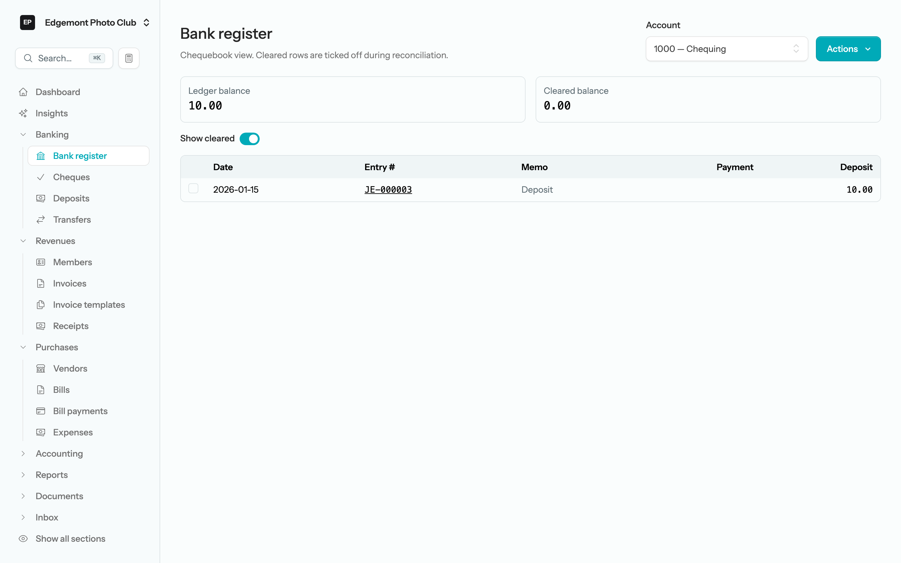
*Figure 24 — The Chequing register: ledger balance $10.00, cleared balance $0.00, one row and no tick yet.*

The deposit's ledger entry — out of the drawer, into the bank:

| Account | Debit | Credit |
|---|---:|---:|
| 1000 — Chequing | $10.00 | |
| 1200 — Undeposited Funds | | $10.00 |

# Reconcile January

In early February the credit union's January statement arrives:

| Edgemont Community Credit Union — Statement, January 2026 | |
|---|---:|
| Opening balance, Jan 1 | $0.00 |
| Jan 15 — Deposit | +$10.00 |
| Jan 31 — Service charge | −$2.00 |
| **Closing balance, Jan 31** | **$8.00** |

Reconciling means proving your books against this statement, item by item, until the difference is zero. It's the treasurer's monthly act of accountability — and in LineLedger it takes about a minute.

> **Why this matters.** A reconciled month is the difference between "I think the books are right" and "the bank agrees the books are right." It catches missed transactions, double entries, and typos while they're days old instead of at year-end. Make it a monthly habit; your auditor (and your successor) will thank you.

## Begin the reconciliation

Open **Banking → Bank register** and choose **Actions → Reconcile**. That opens the
*Reconcile* page for 1000 — Chequing, which for now says *No completed reconciliations on
this account yet.* Click its **Reconcile** button. The *Begin reconciliation* dialog asks
for the statement's bottom line — and right here is where you record the service charge,
without leaving the flow.

The first thing in the dialog is a **Drop your statement to auto-fill** field: hand it the
statement as a PDF or an OFX/QFX file and LineLedger reads the ending balance and statement
date into the fields below (both stay editable). The club's credit union mails a paper
statement, so Riley types the figures in:

| Field | Value |
|---|---|
| Statement date | 2026-01-31 |
| Beginning balance | 0.00 *(calculated for you)* |
| Ending balance | 8.00 |
| Service charge — Amount | 2.00 |
| Service charge — Date | 2026-01-31 *(follows the statement date)* |
| Service charge — Account | 6010 — Bank Charges *(picked for you)* |
| Interest earned — Amount | *(leave blank — the club earned none)* |

> **Note.** **Statement date** doesn't default to today the way most date fields do. On an
> account that has never been reconciled it pre-fills with the end of the current month, and
> from the second reconciliation on it pre-fills with the month after the last statement — so
> from February onward it's usually right without touching it. For this backdated January
> statement, set it to 2026-01-31 first; the service charge date follows along.

*Figure 25 — The auto-fill field at the top, then statement date, ending balance, the $2 service charge to the Bank Charges account from chapter 3, and an unused Interest earned block.*

Click **Continue**. LineLedger posts the service charge for you and marks it cleared — it's on the statement, after all.

## Clear the transactions

The reconciliation screen opens with a bar showing the account, statement date, and ending balance, then two panes: money out (*Cheques and Payments*) and money in (*Deposits and Other Credits*), with a running summary card beneath them that stays in view at the bottom of the window when the lists are long. The service charge is already marked. The deposit isn't yet — and the summary shows the difference you still have to explain. Further down, *Statement & documents* takes the bank statement file if you have one.

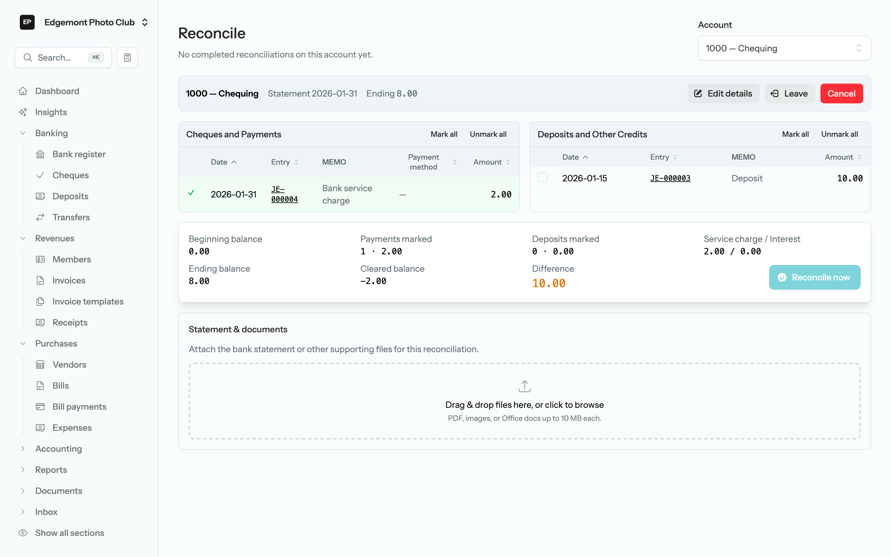
*Figure 26 — One item left to clear. Difference: $10.00 — exactly the unmarked deposit.*

Click the empty box beside the deposit to mark it cleared (*Mark all* does a whole pane at once). The difference drops to **$0.00** and the **Reconcile now** button lights up.

*Figure 27 — Cleared balance $8.00, ending balance $8.00, difference $0.00. The books match the bank.*

Click **Reconcile now**.

## The proof

LineLedger files the reconciliation and brings you back to the *Reconcile* page: a *Reconciliation complete.* message pops up, the line under the heading now reads *Last reconciled on Jan 31, 2026*, and the January statement is listed below. Click its **2026-01-31** row to open the permanent record, *Reconciliation #1*: balances, the service charge, who completed it and when, and every item cleared. You can attach the bank statement PDF right on this page — future-you will be glad it's there — and **Download** saves the record as PDF, CSV, or Excel.

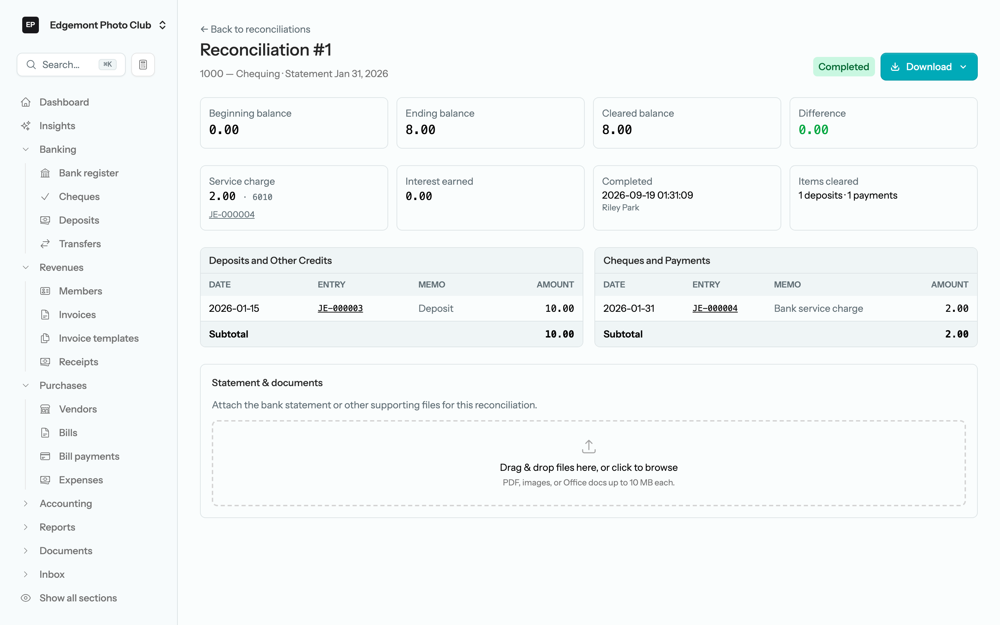
*Figure 28 — Reconciliation #1, completed. Difference $0.00, one deposit and one payment cleared, statement attachable below. The Completed stamp is the real moment Reconcile now was clicked — here, the day these screenshots were taken.*

The service charge's ledger entry, which LineLedger posted from the dialog:

| Account | Debit | Credit |
|---|---:|---:|
| 6010 — Bank Charges | $2.00 | |
| 1000 — Chequing | | $2.00 |

# Read Your Month-End Reports

With January reconciled, the reports almost write the treasurer's report for you. Open **Reports → All Reports** in the sidebar to see everything available — type in *Search reports…* to find one by name, or star a report to pin it to the sidebar. The four below are the monthly staples for a membership club.

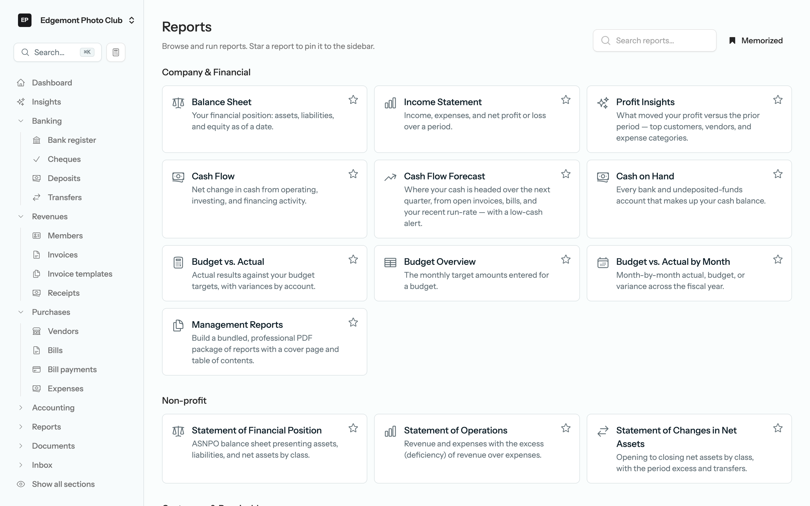
*Figure 29 — The reports hub. Company & Financial at the top, then Non-profit; the membership roster is further down the page, under Membership.*

## Balance sheet — what the club has

Set *As of* to **2026-01-31**. Total assets $8.00 (all of it in Chequing), no liabilities, and net assets of $8.00. Because the club is a non-profit, the equity section speaks the right language: **Net Assets**, with the year's surplus shown as *Excess (deficiency) of revenue over expenses*.

*Figure 30 — Assets = Liabilities + Net Assets: $8.00 = $0.00 + $8.00.*

## Income statement — what happened this month

Set *Start* to **2026-01-01** and *End* to **2026-01-31** (the *Period* box then reads *Custom*). Revenue $10.00 (Membership Dues), expenses $2.00 (Bank Charges), and the non-profit bottom line: **Excess (deficiency) of revenue over expenses, $8.00**.

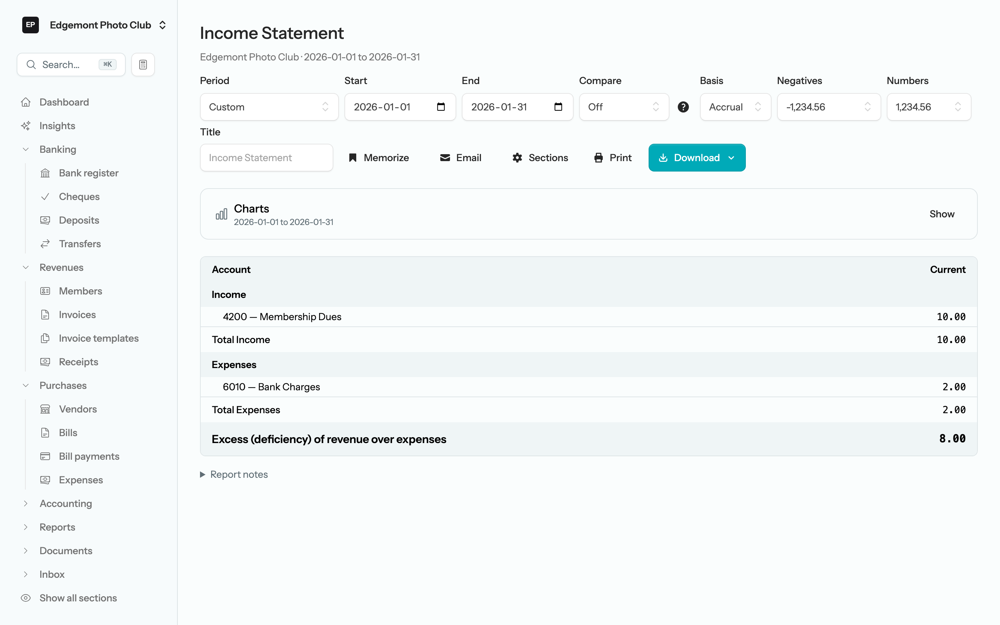
*Figure 31 — January in one page: $10 in, $2 out, $8 kept.*

## Cash flow statement — where the money moved

Same period. Operating activities brought in $8.00 net, and ending cash is $8.00 — for a simple month it confirms the same story, and as the club grows it will explain months where surplus and cash *don't* move together (dues invoiced but not yet collected, for instance).

*Figure 32 — Net change in cash: +$8.00, ending cash $8.00.*

## Membership roster — who the club is

Further down the hub, under *Membership*, **Membership Roster** lists every member with level, status, dates, and any open dues — Alex Tremblay, Founding Member, **Active**, nothing owing. *Active only* is ticked to start; untick it to include inactive members. The **Download** button exports the roster as PDF or Excel for the AGM binder or the membership secretary.

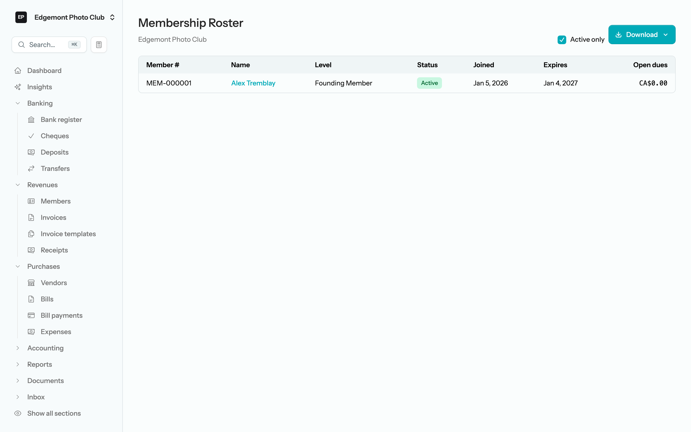
*Figure 33 — One member strong, dues paid in full.*

> **Note.** The hub's *Non-profit* section also offers statements titled the way many boards and funders expect them: the **Statement of Financial Position** (figure 34), **Statement of Operations**, and **Statement of Changes in Net Assets**. Same numbers, formal presentation.

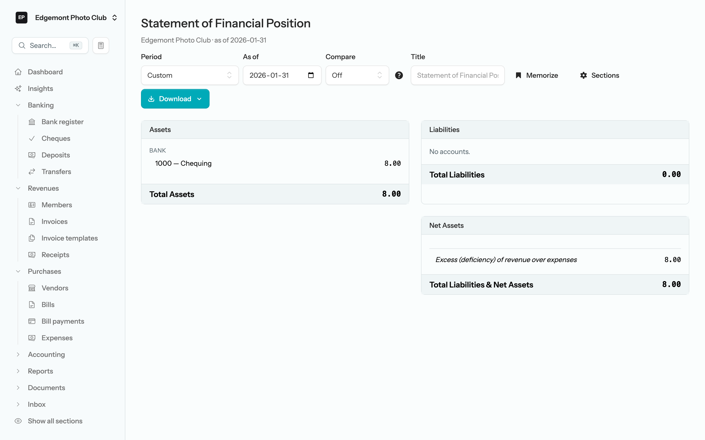
*Figure 34 — The Statement of Financial Position as of January 31, 2026 — the balance sheet in its Sunday best.*

# Where to Go Next

January is closed: invoiced, collected, deposited, reconciled, and reported. A few directions worth exploring as the club grows:

- **Auto-renew dues.** Click **Edit** on a member's page and switch on *Auto-renew*, and LineLedger generates their renewal invoice each billing period — no February to-do list.
- **More members.** *Members → New member* is the whole flow; the roster, dues billing, and reports scale with you. Existing contacts can be made members too.
- **Invite the executive.** *Settings → Organizations* lets you invite the president or a co-signer with a role that matches what they should see — viewer access for the board, full books for a co-treasurer.
  From then on, only one person edits a record at a time: open an invoice a colleague already
  has open and LineLedger shows who is editing it instead of the form, until they're done (an
  Owner or Admin can take over if they've walked away) — so two treasurers can never overwrite
  each other's work.
- **Import the bank statement.** *Actions → Import statement* on the bank register accepts
  CSV, Excel, OFX/QFX/QBO and PDF statement files, matches each line against the books, and
  learns your payees, vendors, bills and tax codes as you confirm them, so reconciliation gets
  even faster.
- **Donations & grants.** When the club starts fundraising, enable the *Donations & grants* feature in settings — the chart already has the accounts waiting.
- **In-app documentation.** The *Docs* section inside LineLedger covers every module in this
  guide and the ones you haven't met yet — *Opening balances* for a club that isn't starting
  from zero, *Insights*, and *Self-hosting & upgrades* for whoever runs your server.

# Appendix A — January at a Glance

| Measure | Amount |
|---|---:|
| Membership revenue (4200) | $10.00 |
| Bank charges (6010) | $2.00 |
| **Excess (deficiency) of revenue over expenses** | **$8.00** |
| Cash in bank, January 31 | $8.00 |
| Accounts receivable, January 31 | $0.00 |
| Net assets, January 31 | $8.00 |
| Bank statement closing balance | $8.00 |
| Reconciliation difference | **$0.00** |

The treasurer's report, in one sentence: *the club earned $10 in founding-member dues, paid $2 in bank charges, and holds $8 at the credit union — reconciled to the bank statement with zero difference.*

# Appendix B — What Got Posted to the Ledger

Four documents touched the books in January. Here is each one's journal entry — the double-entry view of everything this guide did. Debits always equal credits, in every entry and in total.

**January 5 — Dues invoice INV-000001 posted**

| Account | Debit | Credit |
|---|---:|---:|
| 1100 — Accounts Receivable | $10.00 | |
| 4200 — Membership Dues | | $10.00 |

*The club earned dues revenue; Alex owes $10.*

**January 12 — Receipt REC-000001 (cash) posted**

| Account | Debit | Credit |
|---|---:|---:|
| 1200 — Undeposited Funds | $10.00 | |
| 1100 — Accounts Receivable | | $10.00 |

*Alex paid; the $10 sits in the drawer awaiting a bank run.*

**January 15 — Deposit DEP-000001 posted**

| Account | Debit | Credit |
|---|---:|---:|
| 1000 — Chequing | $10.00 | |
| 1200 — Undeposited Funds | | $10.00 |

*The $10 reached the bank.*

**January 31 — Bank service charge (posted from the reconciliation dialog)**

| Account | Debit | Credit |
|---|---:|---:|
| 6010 — Bank Charges | $2.00 | |
| 1000 — Chequing | | $2.00 |

*The credit union's monthly fee.*

**Closing trial balance, January 31, 2026**

| Account | Debit | Credit |
|---|---:|---:|
| 1000 — Chequing | $8.00 | |
| 1100 — Accounts Receivable | — | — |
| 1200 — Undeposited Funds | — | — |
| 4200 — Membership Dues | | $10.00 |
| 6010 — Bank Charges | $2.00 | |
| **Total** | **$10.00** | **$10.00** |

Every entry above is also visible inside LineLedger — each posted document links to its GL entry (you saw *JE-000001* on the invoice page), and every posting is recorded in a tamper-evident audit log. The books don't just balance; they can prove it.

*This guide was produced against LineLedger 1.1.0 in September 2026 using a live organization; all figures are real output. To regenerate it, see `docs/manuals/README.md` in the LineLedger repository.*
